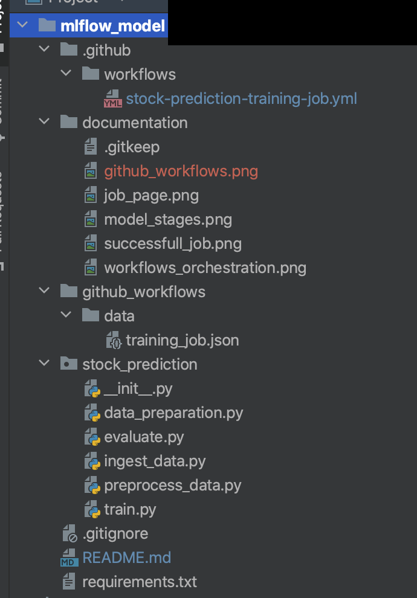

# MLOps POC

---

The MLOps POC runs a sample ml model code on databricks cluster . Model code makes use of mlflow for tracking, registering model.

(*If images don't load on web url , clone the repo . Readme should look fine.*)

---
### Directory Structure Arrangement
The entire code is arranged as per the directory structure shared.

---
### Model Stages 

Model is a simple binary classification time series problem where based on the value given for 
14 days , 15th day stock value is predicted to be either high or low. 

Training pipeline consists of following stages :
- Ingest Data : yahoo finance data for the specifies date range is fetched and downloaded to dbfs path
- Data Preprocess : Train and test data are preprocessed based on the business logic and the transformed data is written as delta .
- Train : Model is trained using RandomForestClassifier , the results are logged as mlflow experiments.
- Evaluate : Classification report is made available (print statement in current state).
`data_preparations.py` is a helper class here. Model code is kept under folder `stock_prediction`

---

### Workflow Stages 

Github Worflow for training pipeline is divided into two stages . training and register. Register stage is having an environment based approval gate defined. 
The idea behind this was that the `training` stage would launch a databricks job with tasks including:

ingest_data -> data_preprocess -> train -> evaluate

We expect in actual scenario evaluate to be a stage where the best training results are shared across with stakeholders and then based on manual approval , register stage is run which registers the model in mlflow registry.
Register step is not included as a part of this training pipeline.

---

### Orchestration

The steps mentioned above are run as tasks as a *part of Databricks Job* . Job defination is stored under folder : `github_workflows/data/training_job.json`
The job is launched on databricks using github workflows. The orchestration is described by the following image:

When Job create is sent only Job defination is created, Job is not run at this stage. Job Page :

This request needs to be followed up by a Job run request by passing the Job id obtained in previous step. Job Run Page :

---
### Changes to be made to run this repo

- Update the branch name in file `.github/workflows/stock-prediction-training-job.yml`  for field `on.push.branches`. 
- Update the Repo path in file `.github_workflows/data/training_job.json`  for field `python_file`.
- Update the github url path in file `.github_workflows/data/training_job.json`  for field `git_source`.
- Add the mlflow experiment id in file `stock_prediction/train.py` and `stock_prediction/evaluate.py`. Experiment Id can be obtained once a mlflow experiment is created in databricks worksapce. Experiment is created for a particular `/User/`.

---

### Pre-requisites/ Assumptions made for POC
*Actual project work will have the following steps as a part of workflow / pipeline* . There are databricks API's available for performing the following operations. For simplicity purpose keeping poc in mind , we assumed these things are created before hand.

- ML Flow Experiment is created in databricks workflow. Experiment name/id is referenced by the mlfow code for the logging part. 
- Personal Access Token is created for the user authenticating to the workspace to run the job. POST requests to databricks API are authenticated using PAT token .
- Databricks Repos is set up and latest code is pulled into that. 
- Storage location considered is dbfs for the poc purpose.
- AWS_DB_HOST & AWS_DB_TOKEN mentioned in file `.github/workflows/stock-prediction-training-job.yml` refer to the databricks host(url) and pat token . These are stored as github repo secrets.

