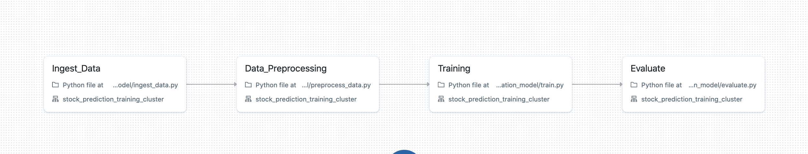
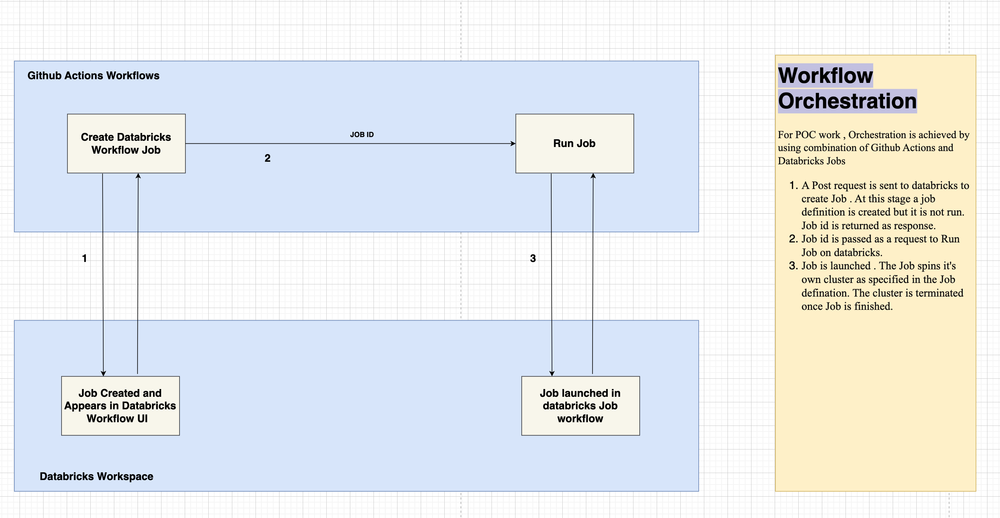
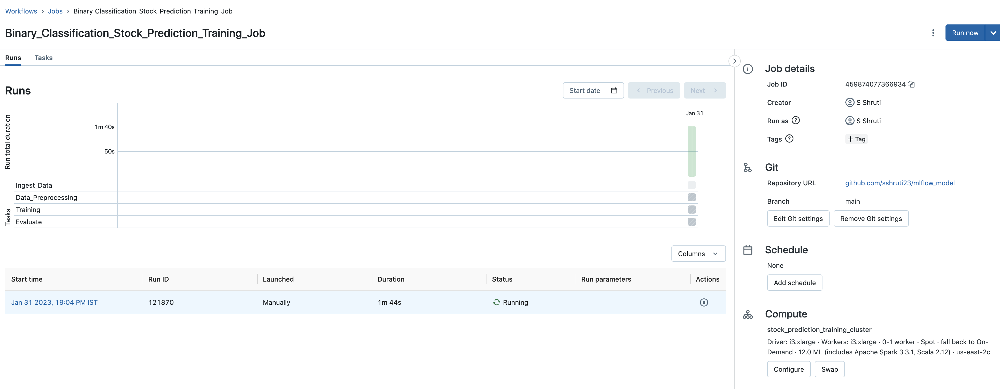
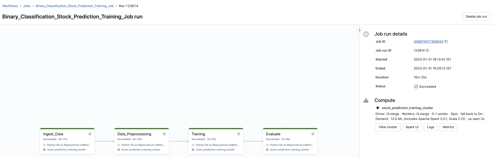

# MLOps POC

---

The MLOps POC runs a sample ml model code on databricks cluster . Model code makes use of mlflow for tracking, registering model.

### Model Description

Model is a simple binary classification time series problem where based o the value given for 
14 days , 15th day stock value is predicted to be either high or low. 

Training pipeline consists of following stages :
- Ingest Data : yahoo finance data for the specifies date range is fetched and downloaded to dbfs path
- Data Preprocess : Train and test data are preprocessed based on the business logic and the transformed data is written as delta .
- Train : Model is trained using RandomForestClassifier , the results are logged as mlflow experiments.
- Evaluate : Classification report is made available (print statement in current state).
Model code is kept under folder `training_binary_classification_model`

---

### Orchestration

The steps mentioned above are run as tasks as a *part of Databricks Job* . Job defination is stored under folder : `github_workflows/data/training_job.json`
The job is launched on databricks using github workflows. The orchestration is described by the following image:

When Job create is sent only Job defination is created, Job is not run at this stage. Job Page :

This request needs to be followed up by a Job run request by passing the Job id obtained in previous step. Job Run Page :

---

### Pre-requisites/ Assumptions made for POC
*Actual project will have the following steps as a part of workflow / pipeline* . There are api's available for performing the following operations.

- Experiment is created in databricks workflow. Experiment name/id is referenced by the mlfow code for the logging part.
- Post requests to databricks API are authenticated using PAT token .
- Databricks Repos is set up and latest code is pulled into that. 
- Storage location considered is dbfs for the poc purpose.

---

### Update the branch name in file `.github/workflows/stock-prediction-training-job.yml`  for the github workflow to run.

---