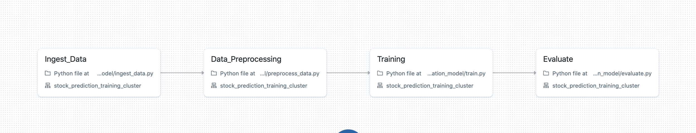
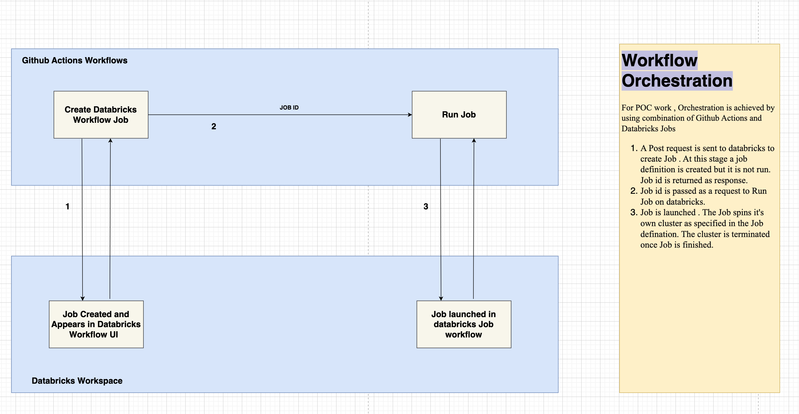

# MLOps POC

---

The MLOps POC runs a sample ml model code on databricks cluster . Model code makes use of mlflow for tracking, registering model.

**Model Description** : Model is a simple binary classification time series problem where based o the value given for 
14 days , 15th day stock value is predicted to be either high or low. 

Training pipeline consists of following stages :
- Ingest Data : yahoo finance data for the specifies date range is fetched and downloaded to dbfs path
- Data Preprocess : Train and test data are preprocessed based on the business logic and the transformed data is written as delta .
- Train : Model is trained using RandomForestClassifier , the results are logged as mlflow experiments.
- Evaluate : Classification report is made available (print statement in current state).
Model code is kept under folder `training_binary_classification_model`

The steps mentioned above are run as tasks as a part of Databricks Job . Job defination is stored under folder : `github_workflows/data/training_job.json`
The job is launched on databricks using github workflows. The orchestration is described by the following image:

